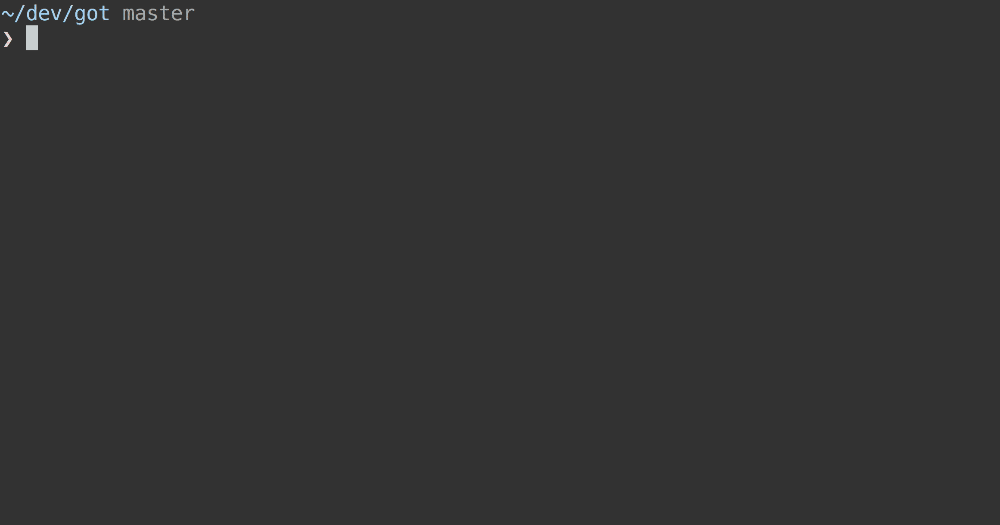

# ava-codemods [](https://travis-ci.org/avajs/ava-codemods)

> Codemods for [AVA](https://ava.li) that simplifies upgrading to newer versions



Codemods are small programs that help you automate changes to your codebase. Think of them as search and replace on steroids.

This module contains a set of codemods that enable you to upgrade your code between various AVA releases. It is maintained by the AVA team, and will be updated anytime we introduce breaking API changes. We plan to eventually introduce codemods that allow you to switch from other popular test runners like `mocha` and `tap`.


## Install

```
$ npm install --global ava-codemods
```


## Usage

```
$ ava-codemods --help

  Codemods to simplify upgrading AVA versions

  Usage
    $ ava-codemods [<file|glob> ...]

  Options
    --force, -f    Bypass safety checks and forcibly run codemods

  Available upgrades
    - 0.13.x → 0.14.x
```

Simply run `ava-codemods` in your terminal and answer a few questions. You can pass a filename directly to the CLI. If you do not, you will be prompted for one.

Ensure you have a backup of your tests or commit the latest changes before running this.


## Supported codemods

### Upgrading to 0.14

- Renaming `t.ok()` to `t.truthy()`
- Renaming `t.notOk()` to `t.falsy()`
- Renaming `t.same()` to `t.deepEqual()`
- Renaming `t.notSame()` to `t.notDeepEqual()`


## License

MIT © [James Talmage](http://github.com/jamestalmage)
